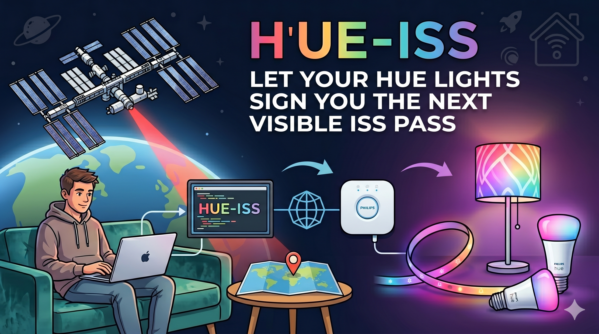
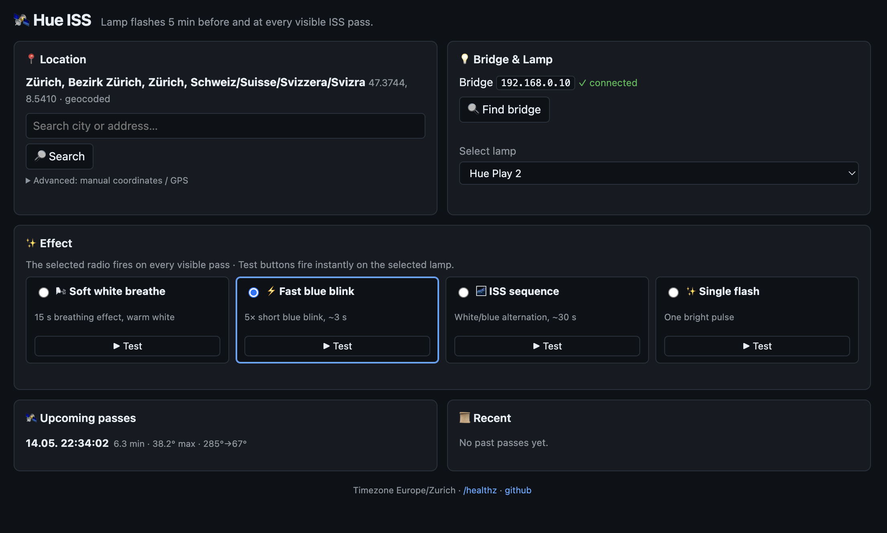

<p align="center">
  
</p>

# hue-iss

> Flash your Philips Hue lamp every time the International Space Station passes
> overhead and is **actually visible** — naked-eye, as a star.

A small self-hosted web app that watches for ISS passes over your location and
pulses a Hue lamp 5 minutes before and at the moment the station appears in the
sky. Designed to run on a Raspberry Pi, a Synology, or any always-on machine
on your home LAN.

[](LICENSE)


## What "visible" means

The ISS is geometrically above the horizon ~5–6 times per day from any given
spot, but you can only **see** it during a narrow set of conditions:

1. Station ≥ 10° above your horizon
2. Station illuminated by the sun (not in Earth's shadow)
3. You are in civil twilight or darker (sun ≥ 6° below your horizon)

This app filters for all three simultaneously. Typically that yields 1–3 truly
visible passes per day, usually in the hour after sunset or the hour before
sunrise. Those are the ones you can spot as a bright moving star.

## Features

- Auto-discovers your Philips Hue Bridge (Link-button pairing, one click)
- Lets you pick **any lamp** on your bridge from a dropdown
- Four built-in light effects, each with a **Test** button so you can preview
  on the actual lamp:
  - Soft white breathe (15 s)
  - Fast blue blink (~3 s)
  - White/blue "ISS sequence" (~30 s)
  - Single bright flash
- Two triggers per pass: **5 min warning** + **pass start**
- Location detection cascade: address geocode → IP-geo → browser GPS →
  manual coordinates
- Restores the lamp's previous state automatically after each effect
- Strict visibility logic powered by `skyfield` + JPL ephemeris + live TLEs
  from Celestrak
- No accounts, no cloud — runs entirely on your LAN

## Screenshot



## Requirements

- Python 3.8 or newer
- A Philips Hue Bridge on the same LAN as the host
- ~50 MB free disk space (skyfield downloads the JPL `de421.bsp` ephemeris
  on first start)

That's it. No Docker required (but supported, see below).

## Quick start

```bash
git clone https://github.com/YOUR_USER/hue-iss.git
cd hue-iss
./setup.sh
./start.sh
```

Open <http://localhost:5057> in a browser. On first launch:

1. Type your city or address into **"Find location"** and press Enter
2. Click **"Find bridge"**, then press the physical Link button on your Hue
   Bridge, then click the discovered IP
3. Pick a lamp from the dropdown
4. Click **▶ Test** next to each effect preset until you find one you like
5. Select that preset's radio button — it will fire on the next visible pass

That's all. The app schedules itself in the background.

## Docker

```bash
git clone https://github.com/YOUR_USER/hue-iss.git
cd hue-iss
cp .env.example .env
# edit .env and set FLASK_SECRET (generate with: python -c "import secrets; print(secrets.token_hex(32))")
docker compose up -d --build
```

> **Note:** the compose file uses `network_mode: host` so the container can
> reach your Hue Bridge via mDNS and the bridge can respond on the LAN.

## Running on a Synology NAS

This is the easiest way to keep hue-iss running 24/7. Tested on DSM 7.

### One-time setup on the NAS

1. In DSM, install the **Git** package (Package Center → search "Git").
2. Enable **SSH** in DSM → Control Panel → Terminal & SNMP → "Enable SSH service".
3. From your computer, connect to the NAS and install the app:

   ```bash
   ssh YOUR_USER@your-nas-ip
   cd /volume1/docker
   git clone https://github.com/GrossmeisterB/hue-iss.git
   cd hue-iss
   ./setup.sh
   ```

4. Start the app in the background (keeps running after you log out):

   ```bash
   nohup setsid ./start.sh > data/app.log 2>&1 < /dev/null &
   ```

5. Open the dashboard from any device on your LAN:
   `http://your-nas-ip:5057`

### Make it start automatically after a reboot

In DSM:

1. **Control Panel → Task Scheduler → Create → Triggered Task → User-defined script**
2. Set **Event** to **Boot-up**, **User** to `root`
3. In the script tab, paste:

   ```bash
   sudo -u YOUR_USER bash -c "cd /volume1/docker/hue-iss && nohup setsid ./start.sh > data/app.log 2>&1 < /dev/null &"
   ```

   Replace `YOUR_USER` with your DSM user name.
4. Save. The app now starts every time the NAS boots.

### Updating later

```bash
ssh YOUR_USER@your-nas-ip
cd /volume1/docker/hue-iss
git pull
./setup.sh               # picks up any new dependencies
pkill -f gunicorn ; sleep 2
nohup setsid ./start.sh > data/app.log 2>&1 < /dev/null &
```

## Configuration

Everything lives in `.env` and the SQLite database (`data/hue-iss.sqlite`):

| Variable      | Default                       | Notes                                  |
|---------------|-------------------------------|----------------------------------------|
| `FLASK_SECRET`| _required_                    | 64-hex random string                   |
| `PORT`        | `5057`                        | Listen port                            |
| `TIMEZONE`    | `Europe/Zurich`               | Display timezone for the dashboard     |
| `DATA_DIR`    | `./data` (or `/data` in Docker)| Where SQLite + TLE cache live         |
| `IP_GEO_URL`  | `https://ipapi.co/json/`      | Initial location fallback              |

Bridge credentials, selected lamp, selected effect, and your location all
live in SQLite — adjust them via the dashboard.

## How it works

```
TLE refresh (every 6 h)
  ↓ Celestrak (NORAD 25544) → SQLite
Pass predictor (every 6 h, after TLE)
  ↓ skyfield rise/set + visibility filter (elevation + sunlit + twilight)
  ↓ APScheduler registers two jobs per upcoming pass: T-5 min and T+0
Trigger job fires
  ↓ Snapshot lamp state → run effect → restore state
```

## Troubleshooting

- **"Find bridge" does nothing** — check the host can reach
  `https://discovery.meethue.com/` (returns JSON listing your bridges).
  If your bridge isn't found, fall back to entering the bridge IP manually
  (see the `/api/bridge/pair` endpoint).
- **No passes shown** — wait a minute after first launch; skyfield downloads
  the ~16 MB JPL ephemeris on first run. Check `/healthz`.
- **Wrong location** — re-search via the address field. Coordinates from
  `ipapi.co` are usually only city-accurate, which is fine for ISS timing
  (10 km offset = ~1.5 seconds of pass-time drift).

## Development

```bash
./setup.sh
source .venv/bin/activate
pytest                # 13 unit/integration tests
python -m app.app     # dev server with reload
```

## Acknowledgements

- [`skyfield`](https://rhodesmill.org/skyfield/) — Brandon Rhodes
- TLE data from [Celestrak](https://celestrak.org/)
- Ephemeris `de421.bsp` from JPL
- [`phue`](https://github.com/studioimaginaire/phue) — Hue Bridge client
- [Alpine.js](https://alpinejs.dev/) — frontend reactivity

## License

MIT — see [LICENSE](LICENSE).
